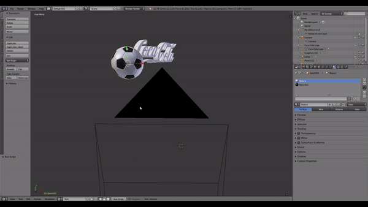

# CS579-Final Project

## Introduction
This is the implementation of "3D Bounding Box Estimation Using Deep Learning and Geometry" on Blender

## Example with 2 3D models:

## Dependency
* [Darknet (for training YOLO)](https://github.com/pjreddie/darknet) 
* [Pytorch (for training orientation angle)](https://pytorch.org/)
* [Numpy](http://www.numpy.org/)
* [Blender (2.79)](https://www.blender.org/)

## Components:
This project comprises 3 main components:
+ ## 2D object detection:
    YOLO: Please follow the instructions from this link: https://timebutt.github.io/static/how-to-train-yolov2-to-detect-custom-objects/ or use the pre-trained model in yolo_coca_minimal_files.
    
    SSD: Follow the guidelines in this link: https://www.dlology.com/blog/how-to-train-an-object-detection-model-easy-for-free/ or use the pre-trained model in ssd_coca folder.

+ ## 3D properties regression:
    Use pytorch_3DBB_orientation.ipynb for training the orientation angle.
    
+ ## 2D-3D conversion:
    Please check the function calculate_loc in Blender for more detail (Open Blender and load coca_cola.blend and navigate to the text file).
    
## Run detection in Blender:
+    Open Blender, load the project (file .blend), and press the Run Script button to run the provided example.
    
+    To run the whole pipeline you need to:

    Include the 2D object detection and 3D MultiBinCNN environment into Blender envi from line 425->429
    Check the location of the 2D image at the save_2d_image function and feed this as input for 2D object detection module.
    
    Replace the coordinate of 2D detection at line 530 and the orientation angle at line 532.

